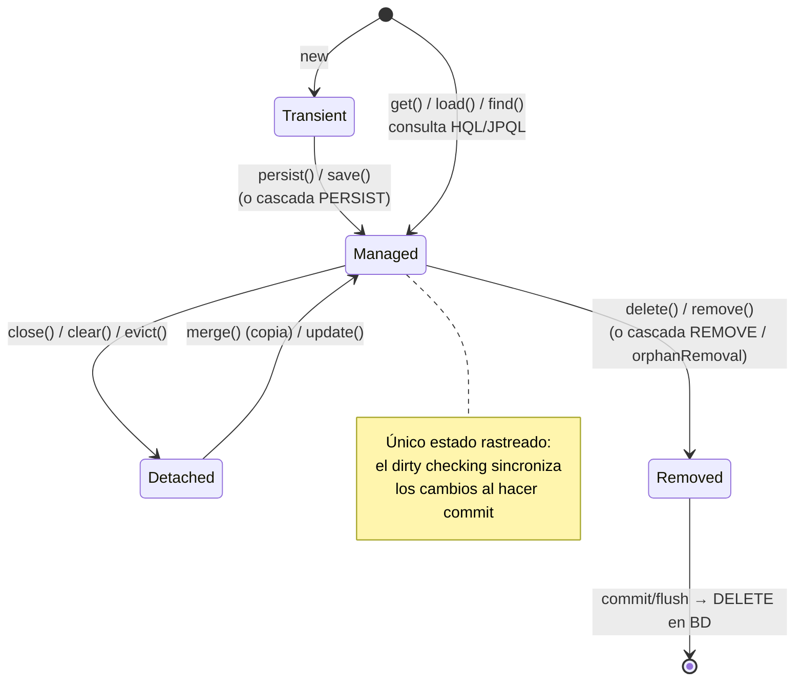

# Introducción a los ORM

## El problema del ORM

### Ejercicio 1: ¿Qué problema concreto resuelve un ORM? Describir al menos 3 (tres) inconvenientes que aparecen al intentar persistir objetos directamente con JDBC puro.

El problema concreto que resuelve un ORM (Object-Relational Mapping) es "impedance mismatch".
- Tres inconvenientes que aparecen al intentar persistir objetos directamente con JDBC (Java Database Conectivity) puro son:
  - Código repetitivo
  - Falta de portabilidad
  - Complejidad (no nos abstraemos de la capa de persistencia, lo que hace que el código sea más difícil de mantener y entender)

>[!NOTE]
> **Impedance mismatch** o diferencia de impedancia describe las diferencias estructurales y conceptuales que existen al intentar hacer coexistir el paradigma orientado a objetos (OO) con el paradigma de las bases de datos relacionales (RDBMS)

### Ejercicio 2: El modelo relacional y el modelo OO presentan tensiones conocidas como impedance mismatch. Identificar cómo se manifiesta cada una en el modelo dado:

#### a)​ Identidad: cómo es posible identificar un objeto Purchase en Java vs. en la base de datos?

La forma de identificar un objeto Purchase en Java, es a través de su **referencia en memoria**, mientras que en la base de datos se identifica a través de una **clave primaria**

#### b)​ Relaciones: cómo se navega de una Purchase a sus ItemService en Java vs. en SQL?

En Java, se navega de una Purchase a sus ItemService a través de una relación de objetos, de manera orgánica a través de las **relaciones del grafo de objetos**. En SQL, se navega a través de una **consulta JOIN** entre las tablas Purchase e ItemService utilizando **claves foráneas** para establecer la relación entre ellas.

#### c)​ Herencia: ¿cómo podría representarse la jerarquía User/DriverUser TourGuideUser en una tabla relacional?

>[!NOTE] 
> El paradigma orientado a objetos soporta las jerarquías de herencia de forma nativa, pero el modelo relacional no soporta jerarquías

Hay tres maneras de representar la jerarquía `User`/`DriverUser`/`TourGuideUser` en una tabla relacional:

- **SINGLE_TABLE**: se mapean **todas las clases de la jerarquía en una sola tabla**, que contendrá los atributos de `User`, `DriverUser` y `TourGuideUser`. Se utiliza una **columna discriminadora** (ej. tipo_usuario) para distinguir a qué clase pertenece cada fila

- **TABLE_PER_CLASS**: se mapean **solo las clases hijas** (`DriverUser` y `TourGuideUser`) en tablas separadas, **copiando y repitiendo los atributos de la superclase** `User` en cada una de ellas.

- **JOINED**: se crea **una tabla para la superclase** `User` (con los datos comunes) **y tablas independientes** para `DriverUser` y `TourGuideUser` (con sus datos específicos), vinculando las tablas de las subclases a la tabla padre mediante el **uso de claves foráneas**

#### d)​ Ciclos de referencia: ¿existe algún ciclo en el modelo? ¿Cómo impacta en la persistencia?

Sí, existe un ciclo de referencia entre `User` -> `Purchase` -> `Route` -> `User (TourGuideUser/DriverUser)`.
La presencia de ciclos afecta fuertemente la forma en que los ORMs y la base de datos gestionan la información:
- **Recursión infinita al recorrer el grafo (persistencia por alcance + cascade)**
  - El framework recorre todos los objetos alcazables para persistir/actualizar. Sin un control para indicar que un objeto ya fue "visitado" en ese recorrido, ocurre un loop infinito si hay un ciclo.
   >[!NOTE]
   > Para que este recorrido en un ciclo no se convierta en un bucle infinito, implementaciones como Hibernate dependen de su Caché de Nivel 1 asociada a la sesión de trabajo, la cual registra las entidades que ya han sido visitadas o guardadas para detener la recursión
- **Peligro de recuperación masiva en memoria (FetchType)**
  - Si el mapeo en JPA se configurara con una estrategia de recuperación ansiosa (`FetchType.EAGER`), intentar cargar un simple `User` obligaría al ORM a cargar sus colecciones de `Purchase`, las cuales cargarían su `Route`, la cual a su vez desencadenaría la carga de todos sus `DriverUser` y `TourGuideUser` asociados, desencadenando una carga en cascada que podría arrastrar prácticamente toda la base de datos a la memoria de la aplicación
- **Necesidad obligatoria del patrón Proxy (Lazy Loading)**
  - Para mitigar el impacto negativo mencionado en el punto anterior, un ciclo fuerza a utilizar la estrategia de **Lazy Loading** para que, cuando se recupere un `User`, el ORM no traerá todo el ciclo recursivamente, sino que recuperará **únicamente los atributos básicos del objeto** e inyectará un Proxy en las colecciones (ej. en sus compras). Estos proxies **solo efectuarán una consulta real a la base de datos si la aplicación intenta acceder a ellos explícitamente**

### Ejercicio 3: Describir las ventajas y deventajas concretas de usar un ORM en un proyecto como este

- **Ventajas**
  - Resuelve la diferencia de impedancia
    - Soporte nativo para jerarquías de herencia, polimorfismo, etc.
  - Independencia de la base de datos
    - Escribimos en términos de objetos y el ORM traduce al dialecto SQL del motor
  - Aplicación persisente por alcance (transitiva)
    - Menos código de persistencia explícito como `save()`/`makePersistent()`
- **Desventajas**
  - Curva de aprendizaje
    - Entender EAGER vs LAZY LOADING, los CascadeType, persistencia por alcance, proxies, cachés de dos niveles, etc.
  - Caja negra
    - El desarrollador no tiene total conocimietno de como se realizan las operaciones
  - Propagación no deseada
    - Persistir por alcance oblica a recorrer todo el grafo, por lo que actualizaciones masivas en cascada pueden impactar negativamente la performance
  - Objetos huérfanos
    - Desvincular de memoria no garantiza el borrado en la base, quedando registros huérfanos si no se configura bien 

## JPA e Hibernate

### Ejercicio 4: ¿Qué es JPA? ¿Qué nos permite definir? ¿Por qué se dice que es una especificación y no una implementación?

JPA (Java Persistence API) es un estándar o API de la industria utilizado en Java para **gestionar la persistencia de los objetos**. Nos permite definir, de forma declarativa, cómo se mapeará nuestro modelo de objetos (las entidades o POJOs persistentes) a las tablas de la base de datos.

>[!NOTE]
> Un **POJO** (Java Old Plain Object) es una clase Java común y corriente sin ataduras a ningún framework

Apoyándose en el concepto de **"Convención sobre Configuración"**, permite a los desarrolladores configurar aspectos como:
- Las **Entidades** y los nombres de las tablas correpsondientes 
- Los **atributos** y **columnas**, especificando sus propiedades, restricciones o ligándolos a métodos `getters` específicos. También permite usar la anotación `@Transient` para indicar que un atributo no debe ser persistido
- Las **estrategias de herencia**, determinando como se representará la jerarquía de clases en un modelo relacional (SINGLE_TABLE, TABLE_PER_CLASS o JOINED)
- El manejo de las **relaciones**, permitiendo definir estrategias de recuperación de datos (`FetchType` configurado como `EAGER` o `LAZY`) y la propagación de operaciones a los objetos asociados medianto los atributos de cascada (`CascadeType` como `ALL`, `PERSIST`, `REMOVE`, etc.)

Se dice que JPA es una **especificación** y no una **implementación** porque únicamente dicta las **reglas, las interfaces y las anotaciones que conforman el estándar** de cómo debe comportarse la **persistencia en Java**, pero no incluye el código o el "motor" interno que realmente ejecuta el trabajo contra la base de datos. Para que JPA funcione, necesita apoyarse en un **software de terceros** que cumpla con estas reglas. Si bien existen varios productos en el mercado que lo hacen, **Hibernate** actúa como la implementación de referencia de este estándar.

### Ejercicio 5: ¿Cuál es la relación entre JPA e Hibernate? ¿Puede usarse JPA sin Hibernate o Hibernate sin JPA?

La relación principal radica en que **JPA** es un estándar o especificación para el manejo de la persistencia, el cual fue creado posteriormente a **Hibernate** y con una **alta influencia de éste** debido a su predominio en el mercado.   
Por su parte, Hibernate es un framework ORM muy popular que actúa como la **implementación de referencia de dicho estándar JPA**.
- **Si es posible usar JPA sin Hibernate**. Dado que **JPA es únicamente un estándar**, requiere de un motor interno ("proveedor") que lleve a cabo el trabajo real. Aunque Hibernate es la opción de referencia, **existen otras implementaciones o productos en el mercado que también soportan el estándar JPA** y pueden utilizarse en su lugar
- **Si es posible usar Hibernate sin JPA**. **Hibernate es un producto que antecede a la creación de JPA** y cuenta con su propia **API nativa**. Por lo tanto, es perfectamente posible utilizar Hibernate de forma independiente haciendo uso de sus propios mecanismos, como la configuración mediante archivos de mapeo XML (`.hbm.xml`) y operando directamente con sus componentes internos (como `Session` y `SessionFactory`), sin necesidad de incluir las interfaces o anotaciones dictadas por JPA

### Ejercicio 6: ¿Qué es la SessionFactory? ¿Qué patrón de diseño implementa? Justificar por qué se crea una sola instancia durante todo el ciclo de vida de la aplicación y no una por operación.

La `SessionFactory` representa una **"instancia" de Hibernate**. **Mantiene el metamodelo en ejecución** representando las entidades persistentes, sus atributos, sus asociaciones y sus mapeos a tablas relacionales, junto con **configuraciones que afectan al comportamiento en ejecución de Hibernate**, e **instancias de servicios que Hibernate necesita para trabajar**.   
Su función central es permitir la **creación de sesiones de trabajo** (`Session`). Cada `SessionFactory` tiene su propio **caché de nivel 2** que comparte entre las sesiones que crea.

>[!NOTE]
> Metamodelo es una descripción del modelo de entidades en sí mismo, es decir, datos sobre sus entidades, como por ejemplo, qué clases son entidades, qué atributos tienen, etc. Es el modelo del modelo

- En cuanto a los patrones de diseño, implementa dos:
  - **Factory**: Actúa como una fábrica encargada de instanciar y proveer las sesiones de trabajo necesarias para que la aplicación interactúe con la base de datos.
  - **Singleton**: Se diseña para que exista una única instancia compartida durante todo el ciclo de vida de la aplicación.

Se crea una sola instancia de `SessionFactory` durante todo el ciclo de vida de la aplicación y no una por operación por varias razones:
1. **Costo de inicialización (Performance)**: Construir la `SessionFactory` es un **proceso "pesado"**. Requiere **leer las configuraciones de conexión** (como el archivo hibernate.cfg.xml) y **compilar todos los archivos de mapeo XML o anotaciones**.Si se creara una instancia por cada operación, el sistema colapsaría al tener que recompilar los metadatos constantemente.
2. **Inmutabilidad**: Una vez construida,  **su metamodelo y configuración no cambian**, por lo que es **seguro y eficiente compartir la misma instancia entre múltiples hilos de ejecución**.
3. **Soporte para la Caché de Nivel 2**: La Caché de Nivel 2 opera a nivel de la `SessionFactory`. Para que los objetos cacheados y los resultados de las consultas puedan compartirse exitosamente entre diferentes operaciones y sesiones de distintos usuarios, es requisito indispensable que todos accedan a la misma instancia central.

### Ejercicio 7: La SessionFactory ofrece dos formas de obtener una `Session`: `openSession()` y `getCurrentSession()`. Responder:

#### a)​ ¿Cuál es la diferencia entre ambos métodos? ¿Qué ocurre con el ciclo de vida de la `Session` en cada caso?

La principal diferencia radica en cómo se inicializa y gestiona la sesión de trabajo contra la base de datos.
- `openSession()`: **crea e instancia una nueva sesión de trabajo** independiente cada vez que se lo invoca. Su ciclo de vida es completamente ajeno al entorno, por lo que **permanecerá abierta hasta que se indique lo contrario**.
- `getCurrentSession()`: no crea una nueva sesión, sino que **recupera y devuelve la sesión que ya se encuentra vinculada al contexto de la transacción activa en el hilo de ejecución actual**. Su **ciclo de vida está atado a la duración de dicha transacción**.

#### b)​ ¿Qué condición debe cumplirse para poder usar `getCurrentSession()`? ¿Qué configuración requiere en Hibernate?

Para que `getCurrentSession()` funcione, la condición estricta es que debe haber un contexto transacccional activo.
>[!IMPORTANT]
> `getCurrentSession()` no gestiona el ciclo de vida de la sesión por sí mismo, se lo delega al contexto (la transacción). ES decir, la transacción es lo que delimita la sesión, definiendo su inicio y su fin 
- En cuanto a la configutación se requiere agregar una propiedad específica en el archivo de configuración `hibernate.cfg.xml` para indicarle al framework cómo debe rastrear el contexto de la sesión actual. Habitualmente se configura la propiedad `<property name="hibernate.current_session_context_class">valor</property>`
  - `valor` puede ser una de las siguientes tres opciones:
      |valor|implementación|cómo ata la sesión|
      |-----|--------------|------------------|
      |`jta`|`JTASessionContext`|La sesión se rastrea y delimita por una transacción JTA|   
      |`thread`|`ThreadLocalSessionContext`|La sesión se ata al hilo de ejecución actual (`ThreadLocal`)|
      |`managed`|`ManagedSessionContext`|También por hilo, pero vos debés hacer el `bind`/`unbind` manual|

>[!NOTE]
> Tener en cuenta que la configuración depende de si se utiliza Hibernate de forma aislada o integrado con un framework como Spring.
​
#### c)​ ¿Quién es responsable de cerrar la `Session` cuando se usa `getCurrentSession()`? ¿Y cuando se usa `openSession()`?

- Con `openSession()`: La responsabilidad es del **desarrollador**. Se debe garantizar la finalización invocando manualmente el método `session.close()`
   >[!NOTE]
   > Habitualmente dentro de un bloque `finally` para asegurar el cierre de la conexión incluso si ocurre una excepción durante la transacción.
- Con `getCurrentSession()`: La responsabilidad es del **entorno o framework subyacente**, ya que la sesión se cierra y limpia de manera automática una vez que la transacción finaliza (sea por un commit exitoso o por un rollback)

#### d)​ ¿Cuál de los dos métodos resulta más adecuado para usar en los repositorios de esta práctica y por qué?

El método adecuado para implementar en los repositorios es `getCurrentSession()`. El diseño de la arquitectura multicapa de la aplicación establece que las **transacciones deben gestionarse en la capa de servicios**, no en la de repositorios. Esto ocurre porque **una misma operación en la capa de servicio a menudo necesita realizar varios accesos a la base de datos interactuando con múltiples repositorios distintos**. Si los repositorios utilizaran `openSession()`, cada invocación generaría una sesión y transacción aislada, haciendo imposible agruparlas de forma segura. Al usar `getCurrentSession()`, todos los **repositorios llamados dentro de un mismo método de servicio comparten la misma sesión y se acoplan orgánicamente a la única transacción global gestionada por la capa de servicio**.

### Ejercicio 8: Completar la tabla comparativa entre JPA e Hibernate

| Aspecto | JPA | Hibernate |
| :--- | :--- | :--- |
| **Tipo** | **Especificación / Estándar (API)**. Define el estándar de persistencia en Java. | **Framework ORM / Implementación**. Es el software (motor) de referencia que implementa la especificación. |
| **Define interfaces y anotaciones** | **Sí**. Establece el estándar: interfaces (`EntityManager`, `EntityManagerFactory`, `Query`) y anotaciones (`@Entity`, `@Id`, `@Column`, `@OneToMany`, `@Inheritance`) con sus convenciones por defecto. | **Sí**. Implementa las de JPA y **además define las suyas propias**: interfaces nativas (`Session`, `SessionFactory`, `Criteria`, `Transaction`) y anotaciones propias que **extienden** el estándar (`@SQLDelete`, `@Where`, `@Type`, `@CreationTimestamp`, `@DynamicUpdate`, `@NaturalId`). |
| **Proporciona implementación concreta** | **No**. Al ser solo un estándar, carece de código ejecutable para interactuar con la BD. | **Sí**. Proporciona la lógica real y el trabajo interno que acciona contra la base de datos. |
| **Genera SQL a partir de consultas JPQL/HQL** | **No**. Solo especifica cómo debe ser el lenguaje estándar (JPQL). | **Sí**. Es el motor interno encargado de compilar el texto HQL/JPQL, traducirlo y generar el SQL nativo para el RDBMS. |
| **Maneja el Persistence Context** | **No**. Solo define las reglas teóricas, las transiciones y los estados posibles de las entidades (ej. *transient*, *managed*). | **Sí**. Administra el contexto de persistencia en la práctica gestionando el ciclo de vida real a través de su `Session` y cachés (como la de Nivel 1). |

>[!NOTE]
> Usar anotaciones estándar de JPA mantiene el código **portable** (se podría cambiar Hibernate por otro proveedor). Usar anotaciones nativas de Hibernate da más potencia pero **acopla** la aplicación a ese proveedor concreto.

## Ciclo de vida de las entidades

### Ejercicio 9: Describir los cuatro estados posibles de una entidad en Hibernate (transient, managed, detached, removed) e indicar qué operación dispara cada transición entre ellos

1. **Transient (transitorio)**
   - Es un **objeto recién instanciado en la memoria** de Java que **no tiene ni tuvo una representación en la base de datos** (no existe una tupla asociada) y **no está vinculado a ninguna sesión o contexto de persistencia actual**. 
   - Se dispara al crear el objeto de manera nativa utilizando la palabra reservada `new` (ej. `new Purchase()`).
2. **Managed (gestionado)**
   - El **objeto tiene una identidad (ID) en la base de datos**, está asociado a una tupla, y se encuentra **vinculado a un Contexto de Persistencia activo** (`Session`). La característica principal de este estado es que el **ORM rastrea el objeto**, cualquier cambio en sus atributos será sincronizado automáticamente en la base de datos al realizar el commit. 
   - Desde el estado transient, se dispara al invocar explícitamente operaciones de guardado como `session.persist()` o `session.save()`, o bien automáticamente si se lo vincula a otro objeto persistente gracias a la propagación en cascada (`CascadeType.PERSIST`). 
   - Desde la base de datos, al recuperar un objeto mediante operaciones de lectura (consultas HQL, `get()`, `load()`, `fetch()`). 
   - Desde detached, se dispara al "reasociar" el objeto a una sesión nueva utilizando `session.merge()` o `session.update()`.
3. **Detached (desvinculado)**
   - Son **objetos que originalmente fueron recuperados dentro de una transacción**, pero que luego de **finalizada la misma han quedado "desasociados" o "desligados" de su sesión original**. Conservan su identidad y sus datos, pero **Hibernate ya no rastrea sus cambios**. Acceder a relaciones no inicializadas en este estado suele provocar excepciones. 
   - Desde managed, la transición natural ocurre al cerrar la sesión (`session.close()`) una vez que finaliza la transacción. 
   - También se dispara al limpiar el contexto completo (`session.clear()`), o al desvincular un objeto puntual mediante `session.evict()` o la operación en cascada `DETACH`.
4. **Removed (eliminado)**
   - Es un **objeto que antes era Managed y que ahora ha sido marcado explícitamente para ser borrado de la base de datos**. El objeto **sigue existiendo en la memoria** de Java, pero su tupla correspondiente **será eliminada físicamente de la base de datos cuando se consolide la transacción**. 
   - Desde managed, se dispara al invocar explícitamente el método `session.delete()` o `session.remove()`. 
   - También ocurre automáticamente al desvincular el objeto de una colección si existe propagación por alcance configurada con `CascadeType.REMOVE` o limpieza de huérfanos (`orphanRemoval`)

**Diagrama de transiciones:**

### Ejercicio 10: Describir el ciclo de vida completo de una entidad persistente, tome como ejemplo un objeto de la clase Purchase: desde que se instancia con new, pasando por su persistencia, hasta que se elimina. Indicar explícitamente en qué estado se encuentra el objeto en cada paso.

1. **Instanciación**
   - El ciclo de vida comienza cuando se crea una nueva instancia `Purchase compra = new Purchase();`.
   - En este momento, el objeto se encuentra en estado **Transient**.
2. **Guardado / Persistencia**
   - Luego se almacena la compra en la base de datos, invocando explícitamente un método como `session.persist(compra)` o `session.save(compra)`, o de forma implícita por persistencia por alcance, agregando la compra a la colección de un `User` que ya está persistido (siempre que la relación tenga configurado un cascaded como `CascadeType.PERSIST o ALL`).
   - Al asociarse, el objeto `Purchase` pasa al estado **Managed**.
3. **Fin de la transacción**
   - Una vez que la capa de servicio termina su trabajo, la transacción se consolida (commit) y la sesión de Hibernate se cierra (ya sea manualmente con `session.close()` o automáticamente si se configuró `getCurrentSession()`).
   - La instancia de `Purchase` que quedó en la memoria de Java pasa al estado **Detached**.
4. **Eliminación**
   - Si el usuario decide cancelar o borrar definitivamente esa compra, el sistema debe iniciar una nueva transacción. Para poder borrar el objeto `Purchase`, este debe volver primero al estado **Managed** (por ejemplo, recuperándolo de la base de datos con un `session.get()` o reasociando el objeto desasociado con `session.merge()`). Una vez que el objeto vuelve a estar gestionado por la sesión activa, se invoca la operación de eliminación mediante `session.delete(compra)` o `session.remove(compra)` (o implícitamente por cascada si se elimina el User dueño de la compra).
   - El objeto pasa al estado **Removed**. 

### Ejercicio 11: Investigue sobre los métodos de Session: session.save(), session.persist(), session.merge() y session.saveOrUpdate(). ¿Qué permite hacer cada uno y cuál es la diferencia entre ellos? Indicar en qué estado debe estar un objeto para usar cada uno correctamente.

1. `session.save()`
   - Toma un **objeto volátil recién creado**, le **genera un identificador** (Clave Primaria) y lo **guarda en la base de datos**, asociándolo a la **sesión actual**.
   - **Estado inicial requerido**: El objeto debe estar en estado **Transient** (Transitorio).

2. `session.persist()`
   - Al igual que `save()`, toma una instancia nueva y la hace persistente insertándola en la base de datos.
   - **Estado inicial requerido**: El objeto debe estar en estado **Transient** (Transitorio).
   >[!NOTE]
   > `persist()` sobre un objeto **Detached** lanza excepción

3. `session.merge()`
   - Su función principal es **tomar los cambios realizados en un objeto que había quedado fuera de una transacción y sincronizarlos** (reasociarlos) con la base de datos en una nueva sesión activa.
   - **Estado inicial requerido**: Está diseñado principalmente para usarse con objetos en estado **Detached** (Desasociados).
  
    >[!NOTE]
    > Si se le pasa un objeto **Transient**, no falla, crea una copia nueva en estado **Managed** y la inserta. Si se le pasa uno ya **Managed**, devuelve esa misma instancia (no hace nada extra). Es decir, `merge()` nunca falla por el estado del objeto.

4. `session.saveOrUpdate()`
   - Es un método de conveniencia que **le dice a Hibernate que decida automáticamente qué hacer con el objeto**. Si el objeto es nuevo lo **guarda (save)**, y si el objeto ya existía lo **actualiza (update)**.
   - **Estado inicial requerido**: Puede estar tanto en estado **Transient** (en cuyo caso ejecutará un guardado) como en estado **Detached** (en cuyo caso ejecutará una actualización).

#### Diferencias

| `session.save()` | `session.persist()` | `session.merge()` |`session.saveOrUpdate()`|
|------------------|---------------------|-------------------|------------------------|
|Método nativo e histórico de Hibernate (no pertenece al estándar JPA). Su característica principal es que retorna inmediatamente el identificador generado en forma de un objeto Serializable, forzando en muchos casos a ejecutar la sentencia `INSERT` en ese mismo instante. | Método oficial dictado por el estándar JPA. A diferencia de `save()`, el método `persist()` no retorna nada (void) y no garantiza que el identificador se asigne en ese preciso milisegundo (usualmente posterga la ejecución del `INSERT` hasta el momento del flush o commit de la transacción). | Método del estándar JPA. Su diferencia fundamental radica en cómo opera con la memoria, no reasocia el objeto original que se le pasa como parámetro, sino que crea y retorna una copia nueva (la cual pasa a estar en estado Managed). El objeto original sigue estando desasociado y no es rastreado por Hibernate. | Método nativo de Hibernate. La diferencia radica en que le quita al desarrollador la carga de saber de antemano si el objeto venía de la base de datos o si recién fue instanciado. Hibernate toma la decisión internamente verificando si el atributo mapeado como identificador (`@Id`) está vacío/nulo o si ya contiene un valor. | 