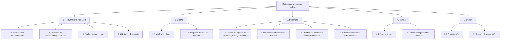

# Práctica 1 – Administración de Proyectos y Costos

## Parte II: Planificación y WBS

### Ejercicio 4: Una universidad necesita desarrollar un sistema de inscripción a materias online. Dicho sistema deberá permitir que los alumnos se inscriban a las materias, validar las correlatividades y generar listados para los docentes.

#### a) Proponga una descomposición del proyecto en actividades principales (nivel 1) y descompóngalas en tareas (nivel 2).

**Diagrama WBS:**

#### b) Explique qué criterio utilizó (por fases, entregables, etc.) y justifique por qué es adecuado para este proyecto.

Se utilizó un enfoque **uniforme por sustantivos** para todos los niveles del WBS. Esto permite que cada elemento de la estructura represente un **entregable concreto y verificable**, facilitando el control de la calidad y la gestión del avance del proyecto sin ambigüedades entre acciones y proyectos 

### Ejercicio 5: Revise el siguiente conjunto de tareas y determine cuáles NO cumplen criterios de completitud. Justifique y corríjalas:

#### "Desarrollar sistema"

Esta tarea no cumple con los siguientes criterios de completitud:
- **Duración aceptable**: desarrollar un sistema completo supera por mucho las 2 semanas sugeridas de duración para una tarea
- **Acotada**: no se define un evento de fin específico antes de la entrega total
- **Independiente**: es la suma de todas las tareas del proyecto y requiere inputs constantes de todas las áreas

**Corrección**: Entregar módulo de inscripción a materia (o cualquier componente específico que pueda terminarse en 10 días o menos)

#### "Hacer pruebas"

Esta tarea no cumple con los siguientes criterios de completitud:
- **Acotada**: no define qué se prueba ni el alcance, por lo que no se sabe cuándo termina.
- **Estado medible**: no nos permite saber si estamos al 20% o al 80% del trabajo
- **Producir entregable**: no produce ningún entregable

**Corrección**: Documentar y ejecutar test unitarios del módulo de inscripción

#### "Diseñar base de datos en 2 días"

Esta tarea no cumple con los siguientes criterios de completitud:
- **Tiempo y costo medibles**: El nombre de la actividad no debe contener la duración

>[!NOTE]
> La estimación es una propiedad de la tarea, no su identidad. Si el tiempo cambia, la tarea "deja de existir" por su nombre

**Corrección**: Modelo físico de la base de datos

### Ejercicio 6: Explique con un ejemplo la diferencia entre duración y esfuerzo, mostrando cómo cambia al agregar recursos.

La **duración es el tiempo de calendario que toma la actividad de inicio a fin**, mientras que, el **esfuerzo es el trabajo total requerido medido en horas-persona**.

La relación teórica dice que:

$Duración = Esfuerzo / Recursos$

**Ejemplo:**

Limpiar una pileta olímpica 
- Se estima que limpiar toda la pileta requiere 12 horas-hombre de labor (este número es fijo independientemente de cuánta gente trabaje)
  - Si disponemos de una persona para limpiar, y la misma tiene una jornada de 6 horas por día, la duración será de 2 días
  - Si disponemos de dos personas para limpiar, ambas con jornadas de 6 horas, el esfuerzo se reparte, y la duración se reduce a un día laboral

>[!IMPORTANT]
> **Al agregar recursos**:
> - El **esfuerzo se mantiene constante** (o sube ligeramente por la necesidad de coordinar)
> - La **duración tiende a disminuir** (siempre que la tarea sea divisible)

El **Crash de la actividad** consiste en agregar más recursos para mantener la duración de una actividad dentro de los límites planificados. Pero hay un punto conocido como **crashpoint**, en el cual, si seguimos agregando recursos (por ejemplo, en este caso, 10 para limpiar la pileta), la coordinación y el estorbo mutuo hacen que la duración deje de bajar e incluso aumente.

